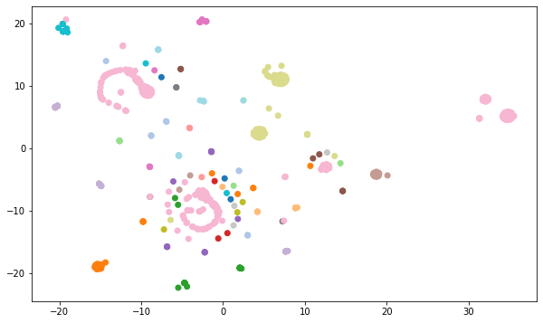

# unsupervised-learning-challenge

### Robert Lane

# Overview

This project analyses crypto currency in an attempt to cluster various types of unknown classifications.  After filtering the list down to crypto that is both being traded, has coins mined, and has at least one coin in supply, the number of coins included dropped from 1,252 to 532 - over half filtered out.

# Analysis

While accounting for both the algorithm and the proof of work, there were 98 variables to explore.  The list was first reduced using Principle Component Analysis, followed by t-SNE in order to make something which could fit on a single chart.  To add color to the chart, the first 4 letteres of the 'ProofType' column were used in order to group similar proofs and reduce visual complexity.  From there, LabelEncoder converted unique items into a number code that was convenient for a colormap.

Interestingly enough, the t-SNE algorithm varies considerably between instances.  It also changes rather rapidly with minor adjustments to the learning rate.  For now, it seems more of an art to getting something charted which shows proper grouping.

# t-SNE charts

A t-SNE chart is a method employed to reduce many axes of inputs into just 2 or 3 so that it can be charted on a 2-axis or 3-axis chart.  These charts were created using the same t-SNE settings.  The third image is merely colored to show grouping by algorithm instead of proof.

# KMeans Clustering

### Recommendation
Based on the KMeans Clustering, it looks as though cryptocurrencies can be ideally clustered into 4 groups; this becomes a more apparent number if the range of clusters tested are extended to 20.  This also matches the number of clusters shown in the earlier t-SNE chart.